# Облачный файловый сервис

Этот проект представляет собой RESTful файловый сервис, разработанный на **Spring Boot**. Он предоставляет пользователям возможность загружать, скачивать, просматривать список файлов, удалять и переименовывать файлы. Доступ к функционалу обеспечивается через токен-аутентификацию. Проект интегрируется с готовым фронтенд-приложением.

---

## Основные возможности

- **Авторизация пользователей** через токен (методы `/login` и `/logout`).
- **Загрузка файлов** на сервер.
- **Скачивание файлов** с сервера.
- **Удаление файлов**.
- **Переименование файлов**.
- **Просмотр списка файлов**, загруженных пользователем.

---
# Архитектура приложения

## Диаграмма взаимодействия компонентов

```plantuml
@startuml
actor User

entity "Frontend (Vue.js)" as Frontend
entity "Backend (Spring Boot)" as Backend
entity "PostgreSQL Database" as DB
entity "Docker" as Docker

User -> Frontend : Отправка HTTP-запроса
Frontend -> Backend : HTTP-запрос с токеном (Header auth-token)
Backend -> DB : Запрос к базе данных (пользователи, файлы)
DB -> Backend : Ответ с данными
Backend -> Frontend : Ответ с данными (JSON)
Frontend -> User : Отображение данных

Frontend -> Docker : Развертывание контейнера
Backend -> Docker : Развертывание контейнера
Docker -> Frontend : Работа в контейнере
Docker -> Backend : Работа в контейнере

@enduml

## Технологии

- **Backend**: Spring Boot
- **Frontend**: Готовое приложение на Node.js (VUE.js)
- **Сборщик**: Gradle/Maven
- **База данных**: Любая реляционная или NoSQL база данных (например, PostgreSQL, MySQL или MongoDB).
- **Контейнеризация**: Docker, Docker Compose
- **Тестирование**: JUnit, Mockito, Testcontainers

---

## Требования к окружению

- **Java**: 17+
- **Node.js**: 19.7.0+
- **Docker**: последняя версия
- **Docker Compose**: последняя версия

---

# Архитектура приложения

## 1. Frontend (Vue.js)

- Клиентская часть, которая отвечает за взаимодействие с пользователем.
- Отправляет HTTP-запросы на сервер, получает и отображает данные.
- Для авторизации используется токен, который передается в заголовках запросов (`Header auth-token`).

## 2. Backend (Spring Boot)

- Серверная часть, которая обрабатывает запросы от Frontend.
- Реализует методы для авторизации, загрузки/удаления/списка файлов, а также другие действия.
- Все запросы должны быть авторизованы через JWT-токены.
- Работа с базой данных для хранения информации о пользователях и файлах.

## 3. База данных (PostgreSQL)

- Хранит информацию о пользователях (логины и пароли) и файлы (ссылки на файлы, размеры, имена).
- Используется PostgreSQL для хранения данных, что позволяет эффективно управлять реляционными данными и обеспечивать высокую производительность.

## 4. Docker и Docker Compose

- Для развертывания приложений (Frontend и Backend) с помощью контейнеров.
- Удобство запуска и масштабирования на разных машинах.


# Руководство по настройке Backend и Frontend

---

## 1. Настройка Backend

### 1.1 Подготовка проекта

1. Установите [Java Development Kit (JDK)](https://www.oracle.com/java/technologies/javase-downloads.html) версии 17 или выше.
2. Убедитесь, что установлены **Docker** и **Docker Compose**.
3. Клонируйте репозиторий проекта:
   ```bash
   git clone https://github.com/ваш-профиль/название-репозитория.git
   cd название-репозитория
# Конфигурация Backend

---
## Настройка CORS (Cross-Origin Resource Sharing)

Чтобы Frontend мог обращаться к Backend, необходимо настроить CORS в приложении Spring Boot. Это позволяет разрешить запросы с другого домена, например, с `http://localhost:8080`.

### Инструкция по настройке

1. **Создайте класс конфигурации CORS:**

   В папке `src/main/java/com/example/config` создайте файл `WebConfig.java` и добавьте следующий код:

   ```java
   import org.springframework.context.annotation.Configuration;
   import org.springframework.web.servlet.config.annotation.CorsRegistry;
   import org.springframework.web.servlet.config.annotation.EnableWebMvc;
   import org.springframework.web.servlet.config.annotation.WebMvcConfigurer;

   @Configuration
   @EnableWebMvc
   public class WebConfig implements WebMvcConfigurer {

       @Override
       public void addCorsMappings(CorsRegistry registry) {
           registry.addMapping("/**") // Разрешение для всех путей
                   .allowCredentials(true) // Разрешение передачи кук и авторизационных данных
                   .allowedOrigins("http://localhost:8080") // URL фронтенда
                   .allowedMethods("*"); // Разрешение всех HTTP-методов (GET, POST, PUT, DELETE и т.д.)
       }
   }

## Файл `application.yml`

### Общая структура
Файл конфигурации `application.yml` содержит настройки для работы сервера, базы данных, аутентификации и других компонентов.

### Пример конфигурации

```yaml
# Настройки сервера
server:
  port: 8080 # Порт, на котором будет работать приложение

# Настройки подключения к базе данных
spring:
  datasource:
    url: jdbc:postgresql://db:5432/cloud # URL базы данных PostgreSQL
    username: postgres                  # Имя пользователя для подключения
    password: postgres                  # Пароль пользователя
    driver-class-name: org.postgresql.Driver # Драйвер базы данных
  jpa:
    hibernate:
      ddl-auto: update                  # Автоматическое создание и обновление схемы базы данных
    properties:
      hibernate:
        dialect: org.hibernate.dialect.PostgreSQLDialect # Диалект базы данных

# Настройки JWT (JSON Web Token)
jwt:
  secret: mysecretkey   # Секретный ключ для подписывания токенов
  expiration: 3600000   # Время жизни токена (в миллисекундах, 1 час)
```


# Настройка Frontend

---

## 1. Установка и запуск Frontend-приложения

### 1.1. Установка Node.js

Для работы с Frontend-приложением потребуется версия **Node.js** не ниже **19.7.0**. Установите Node.js, следуя инструкции на официальном сайте [Node.js](https://nodejs.org/).

### 1.2. Скачивание Frontend-проекта

Скачайте архив с Frontend-проектом или клонируйте репозиторий с помощью Git. Для этого выполните команду:

```bash
git clone <URL репозитория>
```
Перейдите в корневую папку Frontend-приложения:
```bash
cd path/to/frontend
```
Установка зависимостей
```bash
npm install
```
Настройка URL для Backend
```bash
VUE_APP_BASE_URL=http://localhost:8080
```